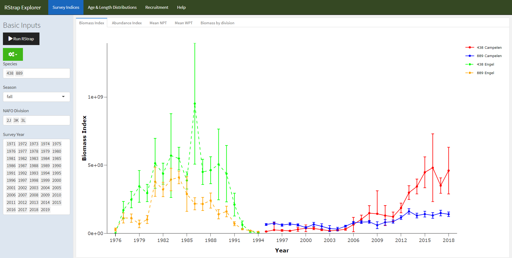
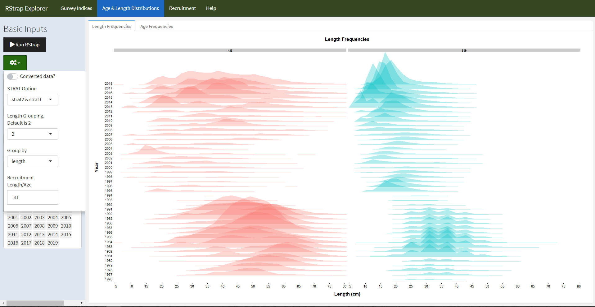
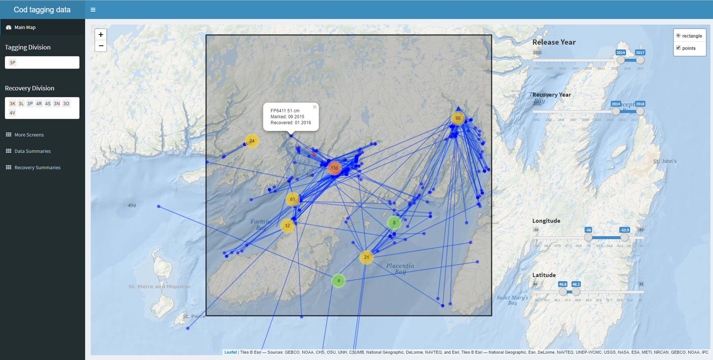
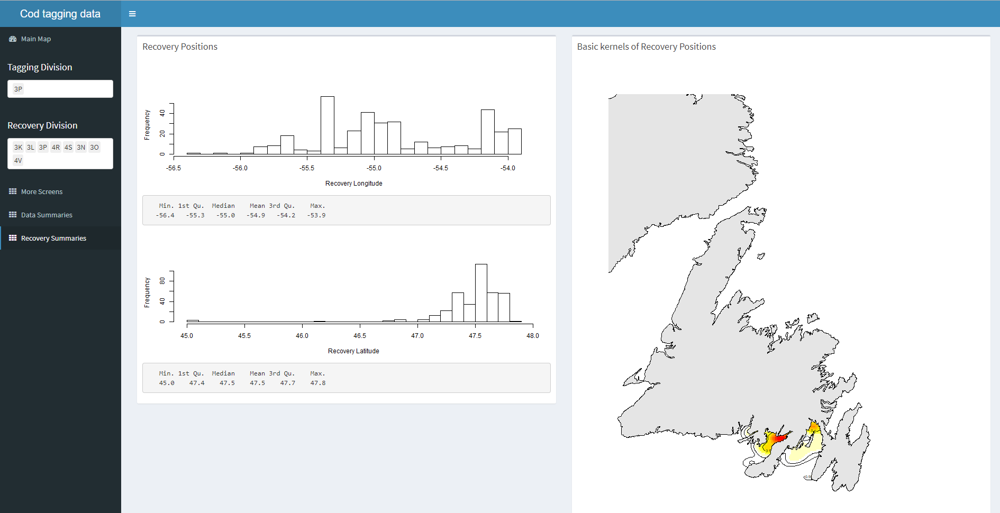
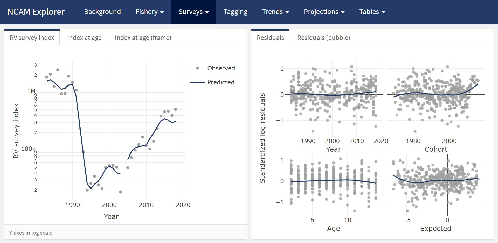

<!-- READ AND REFERENCE: -->
<!-- - https://www.sciencedirect.com/science/article/pii/S1364815210000551 -->

<!-- AIM FOR SHORT COMMUNICATION IN Environmental Modeling & Software -->


Quantitative stock assessment plays a central role in modern fisheries management [@hilborn1992]. Over time, and as new methods are developed, there is an increasing amount of data available to inform stock assessments. These data might be richer information on stock structure using an increasing array of markers and biomarkers, and/or the continued lengthening of population status and catch time series. Concurrently, analytical methods are now able to integrate many data sources into one stock assessment model [@maunder2013]. For well-monitored stocks, the challenge has shifted from having sufficient data and information for providing sound advice on stock status, to presenting large quantities of data and output from increasingly complex statistical models in a meaningful way. Traditional formats (e.g. slides) of presenting information at stakeholder meetings, and to fisheries managers, are simply insufficient to convey the richness of the information available. More importantly, these static and linear formats tend to stifle meaningful discussion as important details and patterns tend to get lost under the sheer volume of output. A solution to this problem is the effective use of interactive visualization tools [@keena2016]. These are common tools we use every day on a range of web sites, but their use is no longer restricted to web site developers as these tools are being integrated into software commonly used by the research community. As a result, an increasing number of scientists across a wide range of disciplines are starting to apply interactive visualization tools to explore and communicate their results [e.g. @jones2016; @yeatman2018; @letcher2018]. This trend includes fisheries research and many of these tools, and the code used to produce them, are available online (see Appendix A for examples).

Here we aim to demonstrate how interactive visualization tools provide an efficient and effective means of exploring and communicating the ever-expanding array of data inputs and model outputs. First, we focus on data that are commonly presented in stock assessments and use interactive plots to simplify the detailed exploration of data from long-term monitoring programs program. Second, we focus on the modeling aspect of stock assessment and demonstrate how dynamic and interactive data visualizations can be used to explore, diagnose and communicate results from an integrated assessment model. This structure corresponds to two important  steps in the stock assessment process: 1) knowing the data, and 2) data modeling.

# Knowing the data

The data sets used in stock assessments are constantly growing due to the continuation of long-term monitoring efforts, the addition of new monitoring programs, or both. As such, stock assessment biologists need to manage large volumes of data from a variety of sources. Time series of reported landings and catch-at-age are often analyzed in conjunction with data from "fishery-independent" surveys that track changes in abundance and, in many cases, also monitor trends in biological factors such as age composition, growth rates, sex ratios and maturation stages. For some data-rich stocks, mark and recapture studies are also carried out to estimate movement, migration, growth rate, natural mortality, and discard mortality. All of the above-mentioned data sets are complex and as the volume and variety of these data increases, it becomes more difficult to be aware of the details of each data set and discover key patterns within each. This challenge can be mediated, to a degree, by the application of interactive visualization tools as that they allow detailed exploration of the data behind a plot. For instance, the ability to zoom in on features or areas of interest, turn off layers and hover over specific points to reveal more information creates an interactive user-driven experience that expedites explorations of data. This is exemplified by two recently developed interactive tools: 1) a tool designed to quickly examine fishery-independent survey data; and 2) an interactive  mapping tool developed for the exploration of a long-term tagging study.

<!-- should the concept of a dashboard be introduced here? -->

## Survey data

Fisheries and Oceans Canada (DFO) has been conducting a multi-species stratified-random survey across the Newfoundland and Labrador shelf since the 1970s [@rideout2018]. Currently, these data are analyzed using a standard stratified analysis via a locally developed R package called RStrap [for details on methodology see @smith1981]. Both the inputs and outputs from the analysis are very large and, depending on the species, the time-series may include > 40 years and span the majority of the Newfoundland and Labrador shelf. In order for people to quickly and reliability explore these data without iteratively modifying R scripts, an app was built using a combination of shiny [@chang2018a], crosstalk [@cheng2016], flexdashboard [@allaire2017], plotly [@sievert2018], and R Markdown [@allaire2018] all within the framework of the R programming language [@R] and the RStudio IDE [@Rstudio]. The app started as a way to visualize estimates of biomass and abundance trends of specific species using the flexdashboard package, however, shiny was latter applied as it allows stratified analyses to be run in the background and therefore allows the user to dynamically explore estimates from multiple species in the one session. Both crosstalk and plotly were incorporated to allow the user to interact with the data. The app contains four primary tabs ("Survey Indices", "Age & Length Distributions", "Recruitment", and "Help") containing stock level estimates of biomass (Figure \@ref(fig:biomass)) and abundance, mean numbers and weights per standardized survey tow, stock level biomass broken out by division, age and length frequencies (Figure \@ref(fig:freq)), and recruitment indices. The number of potential inputs to RStrap are rather large and most do not need to be modified. Some inputs however, do require modification. The input interface on the RStrap Explorer app is divided into two parts: basic and advanced inputs. Basic inputs are those like species, season, and survey year(s). Advanced inputs allow the user to select unconverted data (default) or converted data (which allows for a single complete time-series to be used as opposed to time-series broken by changes in survey gear) and select whether they would like analyses conducted by length and/or age, among others. This app was built for data exploration and allow the user to obtain quick and easy visualization of survey data, but is not meant to replace the through data checking and analysis required for formal stock assessment. 

```{r biomass, echo = FALSE, fig.cap = '- Screen shot of RStrap Explorer tool, using flexdashboard, plotly, and shiny. On the left side of the figure, one can see the "Basic Inputs" sidebar, which is fixed across all pages and allows the user to specify the species, NAFO Divisions, season, and survey years of interest. The "Biomass Index" sub-tab is illustrated here. This sub-tab shows the unconverted time-series of biomass data with 95% confidence intervals (Engle and Campelen) for both cod (*Gadus morhua*; species code 438) and American Plaice (*Hippoglossoides platessoides*; species code 889). All trend lines can be toggled off using plotly’s dynamic user interface. The user also has the ability to hover over the points to compare estimates and export the figure as a png.'}

```


```{r freq, echo = FALSE, fig.cap = '- "Age and Length Frequencies" tab of the RStrap Explorer tool. This tab illustrates the length frequency distributions of both cod (*Gadus morhua*; species code 438) and American plaice (*Hippoglossoides platessoides*; species code 889) binned into 2 cm length bins. The binning is easily modified using the "Length Group" field in the "Advanced Options" drop down menu (shown on left side).'}

```


## Tagging data

Northern cod (NAFO Divisions 2J3KL) has a rich history of tagging, starting in in 1954 [@taggart1995] and continuing to this day. The tagging and recovery data are captured in a standardized database, with fields typical of most tagging programs. This data base has over 600,000 records as of early 2019, with 2,000-10,000 tags deployed annually in recent decades. The tagging and capture data are used in the current assessment model for this stock [@cadigan2016], but tools to explore this extensive data set were limited, especially from a spatial perspective. To begin to explore and understand this large data set, we built a simple shiny [@chang2018a] application using the mapping package leaflet [@cheng2018], all within the framework of the R programming language [@R] and the RStudio IDE [@Rstudio]. Shiny provides a means for the user to easily interface with the application, including options to quickly and dynamically subset the data (e.g. ranges of release and capture years, specific geographic locations). As the application developed, it was incorporated into shinydashboard [@chang2018b], to take advantage of the number of layout options available in shinydashboard. Given the large number of tags released, often at nearby sites, visualizing the data with static mapping was particularly challenging. The markercluster (https://github.com/Leaflet/Leaflet.markercluster) function available in leaflet was particularly useful as a means to dynamically scale the level of pooling of spatial points (Figure \@ref(fig:map)). This basic mapping tool allowed us to quickly become familiar with the data, identify outliers and incorrect data entries, as well as explore options on how to spatially pool the data for subsequent demographic analysis. Further tabs were added to provide basic summaries of the selected data (Figure \@ref(fig:summary)).

```{r map, echo = FALSE, fig.cap = 'Screen shot of cod tag mapping tool using shinydashboard and leaflet. The markercluster function dynamically splits or pools tagging locations (red, orange, green or yellow points) depending on zoom level, the recoveries positions (blue) are much fewer, and are left to be plotted individually at all scales. Options to include pop up labels are included, so specific information on each point can be retrieved with a mouse click (in this case: tag number, fish length, date released, and date captured), which is particularly useful when error checking.'}

```


```{r summary, echo = FALSE, fig.cap = 'Basic summaries of the recovery data from the tags selected within the shiny dashboard cod tag mapping tool. In this case, histograms and summary statistics of the recovery positions are returned, along with a simple map of kernels showing the 2D spatial distribution of the selected tag recoveries.'}

```


# Data modeling

Synthesizing data from multiple sources presents a key challenge to stock assessment. Analyses of different data sources were traditionally carried out independently and the summaries or parameters from these analyses were used in the assessment model. This approach, however, is less than ideal because information may be lost and uncertainty may be unaccounted for when we "do statistics on the statistics" [@link1999; @maunder2013]. Such issues have largely been curtailed in contemporary stock assessments thanks to advances in statistical computing that have facilitated the analysis of all available data, in as raw a form as appropriate, in a single integrated analysis [@maunder2013]. Specifically, statistical modeling tools such as JAGS [@plummer2003], AD Model Builder [@fournier2012] and Template Model Builder [@kristensen2015] allow the construction of a joint likelihood for an array of observations to, in theory, extract as much information as possible about the biological and fishery processes. From a computational perspective, analyses of a variety of large data sets has never been easier. However, from a human perspective, contemporary stock assessment biologists are faced with the challenge of understanding and integrating data from multiple sources into a single model and communicating the methods and results to stakeholders and fisheries managers. Using a recently developed tool for exploring the integrated assessment model for Northern cod as an example, we hope to demonstrate that interactive visualization tools can help meet these challenges.

The Northern cod stock off southern Labrador and eastern Newfoundland is one of the most well studied stocks in eastern Canada, perhaps by virtue of its history. As such, there are multiple monitoring programs that help inform the status of the stock and data from most of these programs have been integrated into a state-space stock assessment model, called NCAM [@cadigan2016]. The model includes information from research vessel autumn trawl surveys (1983-present), Sentinel fishery surveys (1995-present), inshore acoustic surveys (1995-2009), fishery catch-at-age compositions and partial fishery landings (1983-present), and tagging (1983-present). Using a series of observation equations, this TMB based model reduces thousands of historical data points into quantities such as recruitment, spawning stock biomass, fishing mortality and natural mortality. Once the model is fit to the data, the next step is to produce visual representations of the data and model output. The usual approach would be to produce static presentations and documents with a series of figures and tables, but with large amounts of model inputs and outputs, this approach quickly becomes overwhelming for both the analyst and the stakeholders involved. First, it is no longer feasible for the analyst to include and describe every figure and table produced in a single document. Second, it is difficult for stakeholders to efficiently digest the information that has been compressed into a series of static slides or pages. Interactive documents provide a potential solution to this problem as they allow much more information to be contained and accessible on a single screen. 

In the pursuit of an easier and more efficient way to communicate results from NCAM, an interactive and self-contained "dashboard" was developed for the 2018 assessment of Northern cod [@dwyer2019]. The concept of using a dashboard was borrowed from the business community where dashboards are frequently used to group a series of interactive visuals and tables to provide at-a-glance views of key performance indicators. We used R-based packages [@R] and the RStudio IDE [@Rstudio] to construct a tool for exploring the input and output of NCAM, specifically the flexdashboard [@allaire2017] package to group interactive plotly-based [@sievert2018] visuals into a dynamic document. We also used the crosstalk [@cheng2016] package to link the data displayed across multiple plots. Via R Markdown [@allaire2018], the dashboard is rendered into a self-contained html file that is reproducible, interactive, and easy to update following modifications to the model or the addition of new data.

The NCAM dashboard (Supplement 2) contains a series of pages, the first of which provides terse point-form background on the model (page named "Background"). Subsequent pages provide a series of diagnostic plots for assessing model fits to catch ("Catch"), survey ("RV survey", "SN survey" and "SS survey"; accessed from the "Surveys" drop-down menu), and tagging ("Tagging") data. For instance, the "RV survey" page includes plots of observed and predicted values of mean numbers per tow captured in the research vessel survey (Figure \@ref(fig:rv)). The dashboard also includes pages focused on model estimates such as catchability and selectivity ("Catchability"), stock size and vital rates ("Trends"; Figure \@ref(fig:trends)), and stock productivity ("Productivity"). Finally, some results from a retrospective analyses are included under the "Retro" page, trends from different models are compared under the "Comps" page, details on the projections are accessed from the "Projections" drop-down menu ("Assumptions", "Past projections", "Retro projections", and "Results" pages), and key inputs and outputs are accessed from "Tables" drop-down menu ("Inputs", "Settings", "Outputs" pages). The plots and tables included in the dashboard are similar to those typically presented at assessment meetings and in research documents, however, there are two key benefits of this approach over the *modus operandi* of producing static documents and slides: 1) interactive plots nested in a dashboard permit relatively easy and efficient access to the details as it replaces scrolling through tens, if not hundreds, of pages or slides with mouse-clicks across pages holding data-rich illustrations (i.e. both broader patterns and finer details in the data are accessible via zooming and tooltips); and, 2) the automated nature of the dashboard circumvents the monotonous, time-consuming and error-prone task of copying and pasting figures, tables and values into documents and slides. Both benefits expedite the process of exploring a range of model configurations as the automated output facilitate quick views of standard diagnostics and the interactive plots facilitate detailed explorations and model to model comparisons. The dashboard also makes it easy to share the results with colleagues and stakeholders as it is rendered into a self-contained html file. This allows others to independently scrutinize details of the data and model that are typically only accessible to the analyst. Such access improves the transparency of the stock assessment model which, in turn, leads to richer discussion and scrutiny of the biological and statistical rigor of the model. For instance, visualizations depicting the model assumptions, process errors and confidence intervals around the projections raised important questions on the impact of the assumptions on the projections from the model. These questions were raised during the first assessment meeting in which this tool was used and the ensuing discussion helped the assessment biologists, managers and fisheries representatives in the room gain a deeper understanding of the uncertainties and the patterns in the risk tables [e.g Prob(SSB~2020~ &ge; B~lim~)].


```{r rv, echo = FALSE, fig.cap = 'Screenshot of the "RV survey" tab from the NCAM dashboard where total observed (dots) and NCAM model predicted values (lines) for the DFO RV survey index are shown in the upper left panel and scaled matrix plot of age-disaggregated standardized log residuals are shown in the lower left panel (blue = positive, red = negative, symbols scaled by size; grey = index values of zero). Age-disaggregated observed (dots) and predicted (lines) values from the DFO RV survey are shown in the right panel.'}

```


```{r trends, echo = FALSE, fig.cap = 'Screenshot of the "Trends" tab which displays estimates of recruitment, stock size, and stock size relative to B~lim~ (left panels) and mortality rates (F, M, Z, right panels).'}
knitr::include_graphics("figures/NCAM_dashboard_trends_tab.png")
```


# Towards open stock-assessment

The amount of data available to scientists has grown by orders of magnitude in recent decades as has the complexities of data management, exploratory data analysis, formal analyses and associated diagnostics [@lewis2018]. The majority of this sequence of events, sometimes called "the data pipeline" [@leek2015a], have not traditionally been part of the peer-review process which sees only the end products of an analysis. However, decisions made along the data pipeline increasingly influence the outcome of the study. Gelman and Loken [-@gelman2014] coined the term "garden of forking paths" to illustrate that different conclusions can be arrived at depending on what decisions are made along during different stages of the analysis. Due to a number of limitations, such as available pages in journals, much of the data pipeline is not transparent nor is it reproducible. A number of authors have recently advocated for a culture of open science and reproducible research, i.e., a change in the transparency and reproducibility of science [@leek2015a; @leek2015b; @hampton2013; @hampton2015]. Proponents of open science and reproducible research highlight a number of benefits including a more productive and responsible scientific culture, an ability to address larger and more complex questions, as well as a more efficient workflow and ability to reproduce one’s own work [@fomel2009; @lowndes2017].

The tools presented here are additions to the growing number of interactive stock assessment tools being developed and applied across the globe (see Appendix A). We  believe that such tools represent an important a step forward in terms of open science and reproducible research in addition to being a major step forward in how stock assessments are presented and critiqued. While these tools may not reveal the entire data-pipeline, it is unlikely that an individual has the time to fully review and recreate a particular analysis in its entirety when most participants are already overcommitted [@banks2011]. In the case of NCAM, considerable statistical experience and expertise is required simply to run the model. However, the dashboard removes many of these difficulties. The html file contains all model inputs, outputs and diagnostics in an open and easy to use interactive document that can be distributed prior to meetings and, as such, participants can assess the results and diagnostics at their leisure. Specific experience with the tools used to generate the results are not required to constructively and critically review of the results presented in the dashboard.

# Conclusions

We must acknowledge there are costs to adopting the use of interactive tools. The first and obvious one being that staff are required to have both the time and training to effectively develop these tools. In our two examples, the developers (first, second and third authors) were relatively proficient with R and have natural aptitudes for programming, but had their formal training in field-based population ecology. While some learning time was needed (a few weeks), the learning curve was relatively minor because there was no need to learn a new programming language (e.g. JavaScript, CSS, etc.). Moreover, a growing user base means that most programming issues were readily addressed through simple internet searches. We expect the accessibility and quality of these tools to continue to improve as more people in the fisheries community develop and use interactive documents. It is our experience that the upfront investment in time has already paid dividends in terms of efficiencies of delivering products for subsequent stock assessments, and in the quality of the data exploration and understanding. Scientific exploration is rarely a linear process, and the ability to navigate around a dashboard fits the natural way people pursue ideas.

# Acknowledgements

We thank the numerous colleagues and participants of various stakeholder and stock assessment meetings who encouraged us to further develop these interactive visualization tools, and especially those who took the time to make suggestions on how to make them more accessible and useful. We are also grateful for the constructive feedback from Gary Carvalho, Kelli Johnson, Colin Millar and two anonymous reviewers.

# Appendix A

Partial list of applications developed to explore and communicate marine and fisheries science:

- Marine Aggregates Application (https://openscience.cefas.co.uk/ma_tool/) from Cefas
- Benthic Non Native Species Tool (https://openscience.cefas.co.uk/invasive_species/) from Cefas
- Species Dashboard (https://shiny.marine.ie/speciesdash/) from The Marine Institute
- The Stock Book (https://shiny.marine.ie/stockbook/) from The Marine Institute
- Catchy Data (https://eu.oceana.org/en/catchy-data) from Oceana
- VISA tool (e.g. https://ices-tools-dev.github.io/VISA_tool/hke.27.3a46-8abd.html#ices_advice_2018) from ICES, which was developed to meet an "EU request on dissemination of ICES advice beyond pdf files"

# References
