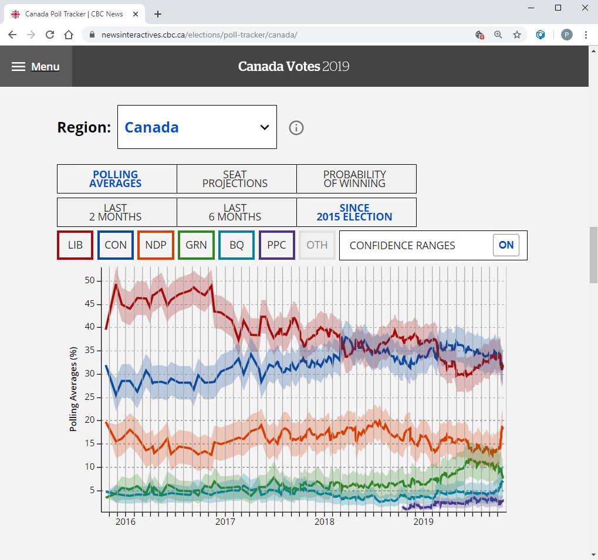

```{r setup, include=FALSE}
knitr::opts_chunk$set(echo = FALSE, 
                      message = FALSE, 
                      warning = FALSE, 
                      fig.height = 5, 
                      fig.width = 10)
knitr::opts_knit$set(root.dir = "../..")

```


```{r data}
## xaringan::inf_mr()

library(NCAM)
library(plotly)
library(ggplot2)
library(emojifont)

htmltools::tagList(rmarkdown::html_dependency_font_awesome())

load("data/NCAM_2018.RData")
fit <- ncam_2018
tabs <- tidy_model(fit)
ages <- fit$tmb.data$ages
years <- fit$tmb.data$years
years_plus1 <- fit$tmb.data$years_plus1
```


```{r bg-fig, eval = FALSE}

d <- trans_est(tabs$Cproj_log_ssb_lrp)
d <- d[d$year != max(years_plus1), ] # drop the first year (it's in the time series)
d$type <- "Projected"
d$scenario <- factor(d$scenario)

## Append full time series to projections
past_d <- trans_est(tabs$log_ssb_lrp)
past_d <- lapply(levels(d$scenario), function(s) data.frame(past_d, scenario = s))
past_d <- do.call(rbind, past_d)
past_d$type <- ifelse(past_d$year == max(years_plus1), "Projected", "Estimated")
d <- rbind(past_d, d)
xlim <- c(max(years) - 2.1, max(years) + 4.1)
ylim <- range(d[d$year >= xlim[1] & d$year <= xlim[2], c("est", "lwr", "upr"), ])

d <- d[d$scenario == 1, ]

xax <- yax <- list(
  title = "",
  zeroline = FALSE,
  showline = FALSE,
  showticklabels = FALSE,
  showgrid = FALSE
)
xax$range <- c(1995, 2025)
yax$range <- c(0, 2)

p <- plot_ly(x = ~year, hoverinfo = "none")

interval <- seq(0.9, 0, length.out = 7)
val <- 1 - ((1 - interval) / 2)
col <- RColorBrewer::brewer.pal(length(interval), "Reds") # viridis::viridis(length(interval))
alpha <- seq(0.1, 1, lenth.out = length(interval))

for (i in seq_along(val)) {
  d$upr <- exp(log(d$est) + qnorm(val[i]) * d$sd)
  d$lwr <- exp(log(d$est) - qnorm(val[i]) * d$sd)
  p <- p %>% 
    add_ribbons(ymin = ~upr, ymax = ~lwr, data = d,
                line = list(width = 0),
                fillcolor = toRGB(col[i]))
}  

p <- p %>% 
  hide_guides() %>% 
  layout(xaxis = xax, yaxis = yax, 
         plot_bgcolor = "transparent", 
         paper_bgcolor = "transparent",
         margin = list(t = 0, l = 0, r = 0, b = 0, pad = 0)) %>% 
  plotly::config(displayModeBar = FALSE)

orca(p, file = "analysis/presentation/figures/bg-fig.png", 
     height = 700, width = 1100, scale = 6)

```


## Background {data-background="figures/bg-fig.png"}

*The greatest value of a picture is when it forces us to notice*   
*what we never expected to see.*  
&nbsp;&nbsp;&nbsp;- Tukey (1977)  

- Discovery is one of the most exciting parts of science
- Visualizations are one of the tools we use to reveal patterns
- Models allow us to simplify and describe these patterns
- At various stages, we need to communicate our findings


## Communicating information 


Simplified workflow:

<hr>

<div style="float: left; width: 20%; text-align: center;">
Data  
<font size="20"><i class="fa fa-database"></i></font>
</div>

<div style="float: left; width: 20%; text-align: center;">
<br>
$\rightarrow$
</div>

<div style="float: left; width: 20%; text-align: center;">
Models  
<font size="20"><i class="fa fa-chart-area"></i></font>
</div>

<div style="float: left; width: 20%; text-align: center;">
<br>
$\rightarrow$
</div>

<div style="float: left; width: 20%; text-align: center;">
Discuss  
<font size="20"><i class="fa fa-comments"></i></font>
</div>

<hr>

<div>
- Connections may not come easy
    - Growing volume and variety of data
    - Increasingly complex models
    - Diverse backgrounds

</div>


## Stock assessments <i class="fa fa-fish"></i>

<div style="float: left; width: 65%;">

- Communicating stock assessment results isn't getting easier  
    - Growing volume and variate of data  
    - Increasingly complex models  
    - Diverse backgrounds  
- Traditional formats sometimes 
    - Overwhelm participants with endless tables and figures
    - Fail to convey the richness of information available 
    
</div>  
    
<div style="float: right; width: 35%;">

```{r, out.width = "100%"}
knitr::include_graphics("figures/doc_screenshots.PNG")
```

</div>  


## Interactive tools

<div style="float: left; width: 55%;">

- Simplify communication and improve accessibility
- Common tools that are used daily on a range of websites
- Their use is no longer restricted to website developers
    - Integrated into software commonly used by the research community
    - Surprisingly easy to generate interactive dashboards
    - Growing number of users

</div>  
    
<div style="float: right; width: 40%; padding-left: 5%">

```{r, out.width = "100%"}

```

</div>  


## Objective

- Here we aim to demonstrate that interactive tools simplify our workflow, from data and model exploration to communication


