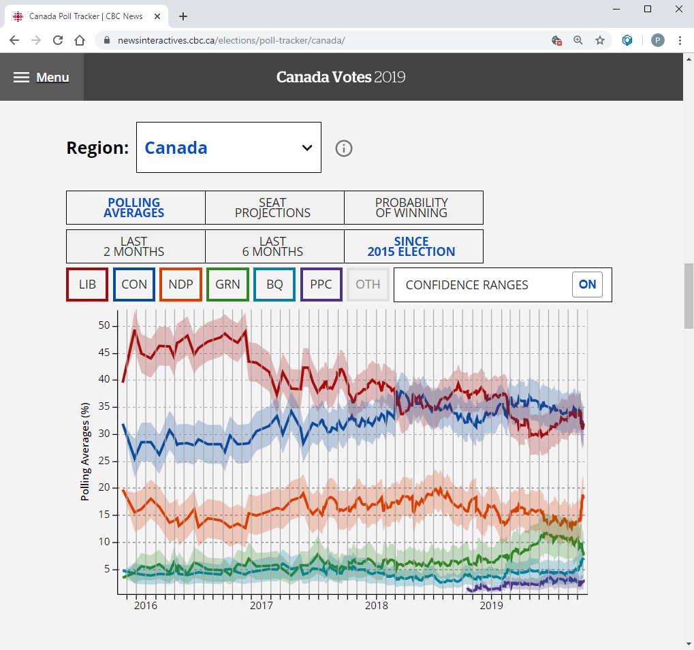
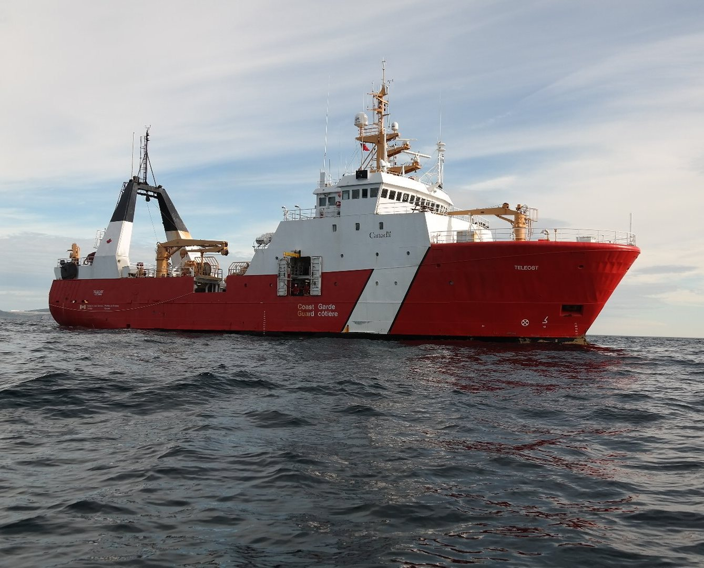
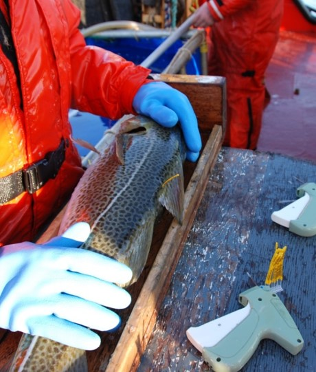
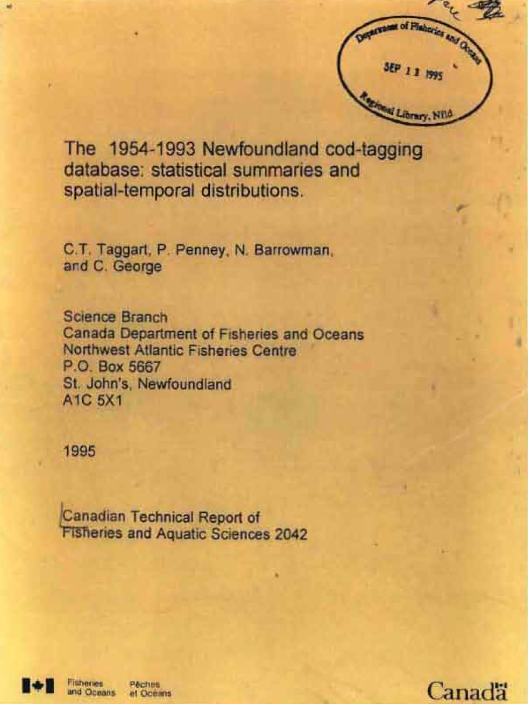
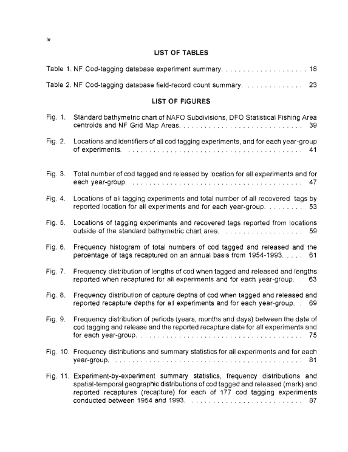
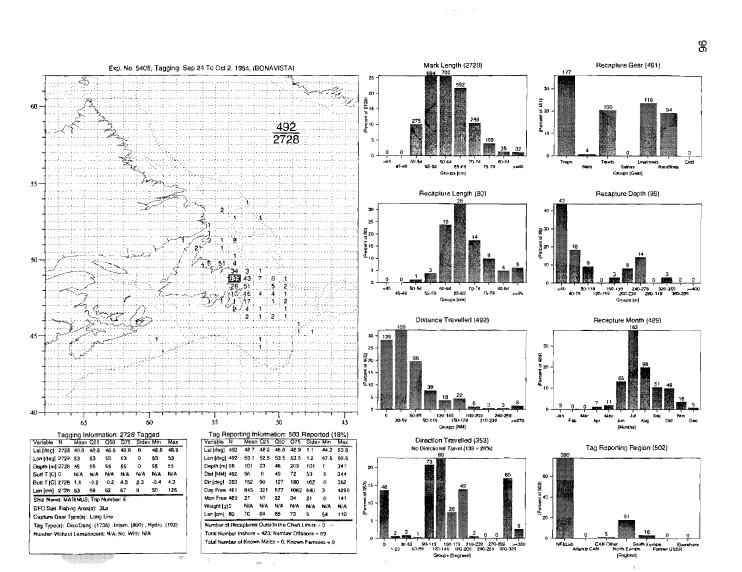
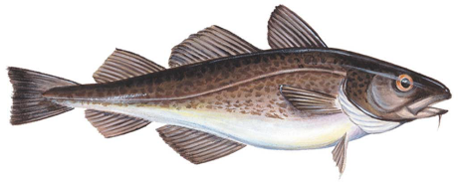

<style>
@import url('https://fonts.googleapis.com/css?family=Montserrat');
</style>

```{r setup, include=FALSE}
knitr::opts_chunk$set(echo = FALSE, 
                      message = FALSE, 
                      warning = FALSE, 
                      fig.height = 5, 
                      fig.width = 10)
knitr::opts_knit$set(root.dir = "../..")

```


```{r data}
## xaringan::inf_mr()

library(NCAM)
library(plotly)
library(ggplot2)
library(emojifont)

htmltools::tagList(rmarkdown::html_dependency_font_awesome())

load("data/NCAM_2018.RData")
fit <- ncam_2018
tabs <- tidy_model(fit)
ages <- fit$tmb.data$ages
years <- fit$tmb.data$years
years_plus1 <- fit$tmb.data$years_plus1
```


```{r bg-fig, eval = FALSE}

d <- trans_est(tabs$Cproj_log_ssb_lrp)
d <- d[d$year != max(years_plus1), ] # drop the first year (it's in the time series)
d$type <- "Projected"
d$scenario <- factor(d$scenario)

## Append full time series to projections
past_d <- trans_est(tabs$log_ssb_lrp)
past_d <- lapply(levels(d$scenario), function(s) data.frame(past_d, scenario = s))
past_d <- do.call(rbind, past_d)
past_d$type <- ifelse(past_d$year == max(years_plus1), "Projected", "Estimated")
d <- rbind(past_d, d)
xlim <- c(max(years) - 2.1, max(years) + 4.1)
ylim <- range(d[d$year >= xlim[1] & d$year <= xlim[2], c("est", "lwr", "upr"), ])

d <- d[d$scenario == 1, ]

xax <- yax <- list(
  title = "",
  zeroline = FALSE,
  showline = FALSE,
  showticklabels = FALSE,
  showgrid = FALSE
)
xax$range <- c(1995, 2025)
yax$range <- c(0, 2)

p <- plot_ly(x = ~year, hoverinfo = "none")

interval <- seq(0.9, 0, length.out = 7)
val <- 1 - ((1 - interval) / 2)
col <- RColorBrewer::brewer.pal(length(interval), "Reds") # viridis::viridis(length(interval))
alpha <- seq(0.1, 1, lenth.out = length(interval))

for (i in seq_along(val)) {
  d$upr <- exp(log(d$est) + qnorm(val[i]) * d$sd)
  d$lwr <- exp(log(d$est) - qnorm(val[i]) * d$sd)
  p <- p %>% 
    add_ribbons(ymin = ~upr, ymax = ~lwr, data = d,
                line = list(width = 0),
                fillcolor = toRGB(col[i]))
}  

p <- p %>% 
  hide_guides() %>% 
  layout(xaxis = xax, yaxis = yax, 
         plot_bgcolor = "transparent", 
         paper_bgcolor = "transparent",
         margin = list(t = 0, l = 0, r = 0, b = 0, pad = 0)) %>% 
  plotly::config(displayModeBar = FALSE)

orca(p, file = "analysis/presentation/graphics/bg-fig.png", 
     height = 700, width = 1100, scale = 6)

```


## Background {data-background="graphics/bg-fig.png"}

*The greatest value of a picture is when it forces us to notice*   
*what we never expected to see.*  
&nbsp;&nbsp;&nbsp;- Tukey (1977)  

- Discovery is one of the most exciting parts of science
- Visualizations are one of the tools we use to reveal patterns
- Models allow us to simplify and describe these patterns
- At various stages, we need to communicate our findings


## Communicating information 


Simplified workflow:

<hr>

<div style="float: left; width: 20%; text-align: center;">
Data  
<font size="20"><i class="fa fa-database"></i></font>
</div>

<div style="float: left; width: 20%; text-align: center;">
<br>
$\rightarrow$
</div>

<div style="float: left; width: 20%; text-align: center;">
Models  
<font size="20"><i class="fa fa-chart-area"></i></font>
</div>

<div style="float: left; width: 20%; text-align: center;">
<br>
$\rightarrow$
</div>

<div style="float: left; width: 20%; text-align: center;">
Discuss  
<font size="20"><i class="fa fa-comments"></i></font>
</div>

<hr>

<div>
- Connections may not come easy
    - Growing volume and variety of data
    - Increasingly complex models
    - Diverse backgrounds

</div>


## Stock assessments <i class="fa fa-fish"></i>

<div style="float: left; width: 65%;">

- Communicating stock assessment results isn't getting easier  
    - Growing volume and variate of data  
    - Increasingly complex models  
    - Diverse backgrounds  
- Traditional formats sometimes 
    - Overwhelm participants with endless tables and figures
    - Fail to convey the richness of information available 
    
</div>  
    
<div style="float: right; width: 35%;">

```{r, out.width = "100%"}
knitr::include_graphics("graphics/doc_screenshots.PNG")
```

</div>  


## Interactive tools

<div style="float: left; width: 55%;">

- Simplify communication and improve accessibility
- Common tools that are used daily on a range of websites
- Their use is no longer restricted to website developers
    - Integrated into software commonly used by the research community
    - Surprisingly easy to generate interactive dashboards
    - Growing number of users

</div>  
    
<div style="float: right; width: 40%; padding-left: 5%">

```{r, out.width = "100%"}
# 
knitr::include_url("https://newsinteractives.cbc.ca/elections/poll-tracker/canada/", height = "300px")
```

</div>  


## Objective

- Using examples we aim to demonstrate that interactive tools can simplify our workflow, from data and model exploration to communication
<br>
- Examples:
    1. **RStrap Explorer:** A tool for examining fishery-independent survey data
    2. **Tag Explorer:** A mapping tool developed for the exploration of a long-term tagging study
    3. **NCAM Explorer:** A tool for exploring results from the Northern Cod Assessment Model


## RStrap Explorer

<div style="float: left; width: 50%;">

- Fisheries-independent surveys have become a mainstay in stock assessment
- Stratified-random surveys have been conducted by DFO for > 40 years
- Typically analyzed using stratified analyses (RStrap in NL region)

</div>  
    
<div style="float: right; width: 45%; padding-left: 5%">

<br>

<font size="1"> 
<br>
&nbsp; <a href="https://twitter.com/coastguardcan/status/879410397790515201">Canadian Coast Guard | Twitter</a>
</font>

</div>  


## RStrap Explorer {.smaller}

> - Running a series of stratified analysis can be cumbersome

```{r, eval = FALSE, echo = TRUE}

library(Rstrap)

## Load survey data
load("converted_set_details_2017-04-27.Rdata")
load("converted_length-frequency_data_2017-04-27.Rdata")
load("age-growth_data_2017-04-27.Rdata")

## 3NO Witch Flounder
witch <- strat.fun(setdet = setdet, data.series = "Campelen", 
                   species = 890, survey.year = 1995:2012, 
                   season = "spring", NAFOdiv = c("3N", "3O"))

## 3K Roughhead Grenadier (length disaggregated)
grenadier <- strat.fun(setdet = setdet, lf = lf, data.series = "Campelen", 
                       program = "strat2 & strat1", species = 474, survey.year = 2012, 
                       season = "fall", NAFOdiv = "3K", strat = 622:654, sex = "unsexed", 
                       length.group = 0.5, group.by = "length")

## 2J3KL Greenland Halibut (length and age disaggregated)
turbot <- strat.fun(setdet = setdet, lf = lf, ag = ag, data.series = "Campelen", 
                    program = "strat2 & strat1", species = 892, survey.year = 1998:2012, 
                    season = "fall", NAFOdiv = c("2J", "3K", "3L"), 
                    sex = c("male","female","unsexed"), length.group = 1, 
                    group.by = "length & age")

## 3Ps Atlantic Cod (length and age disaggregated)
cod <- strat.fun(setdet = setdet, lf = lf, ag = ag, data.series = "Campelen", 
                 program = "strat2 & strat1", species = 438, survey.year = 1998:2012, 
                 season = "spring", NAFOdiv = "3P", sex = c("male","female","unsexed"), 
                 length.group = 1, group.by = "length & age")


```

- This doesn't include code for plotting these results


## RStrap Explorer

- A dashboard was created using the **`shiny`**, **`flexdashboard`**, **`plotly`**, and **`crosstalk`** packages to dynamically run and explore RStrap results
- Four primary pages:
    1. **Survey Indices** contains stock level estimates of biomass and abundance
    2. **Age & Length Distributions** contains length and age frequency plots 
    3. **Recruitment** displays recruitment indices
    4. **Help** provides additional context to the survey data and analysis


## RStrap Explorer {data-background="graphics/RStrap_dashboard_biomass.png" data-background-position="center bottom"}


## RStrap Explorer {data-background="graphics/RStrap_dashboard_freq.png" data-background-position="center bottom"}


## Tag Explorer

<div style="float: left; width: 55%;">

- For some data-rich stocks, mark and recapture studies are carried out to estimate movement, growth rate, natural mortality, etc.
- There is a long-standing tagging program for Northern cod
    - \>60 years, >60,000 records, 1,000 - 10,000 tags deployed annually

</div> 

<div style="float: right; width: 40%; padding-left: 5%">


<font size="1"> 
Photo: John Brattey 
</font>

</div>  


## Tag Explorer

> - Spatial explorations of these data have been limited since the seminal work by Taggart et al. 1995

<div style="float: left; width: 25.6%; padding: 1%">
<div class="drop-shadow" style="background-color: rgb(236, 192, 107);">

</div>
</div>  

<div style="float: left; width: 26.4%; padding: 1%">

<div class="drop-shadow">

</div>

</div>  

<div style="float: left; width: 42%; padding: 1%">

<div class="drop-shadow">

</div>

</div>  

- **Nearly 500 pages!**

## Tag Explorer

- A dashboard was created using the **`shiny`**, **`shinydashboard`**, and **`leaflet`** packages to dynamically explore this large data-set
- Contains
    - One primary page, **Main map**, where release and recovery locations are mapped
    - A series of summary pages where these data are summarized


## Tag Explorer {data-background="graphics/tagging_dashboard_map_tab.png" data-background-position="center bottom"}


## Tag Explorer {data-background="graphics/tagging_dashboard_summary_tab.png" data-background-position="center bottom"}


## NCAM Explorer

<div style="float: left; width: 50%; padding-right: 5%;">

- Integrated stock assessment models are becoming more common
- Advances in computational power and methods $\rightarrow$ possibilities
- Requires a solid understanding of the inputs, methods and outputs
    - Understanding is a prerequisite for communication

</div> 

<div class="drop-shadow" style="float: right; width: 40%; padding: 2.5%; font-size: 8px;">

**Process equations**  
<br>
Stochastic cohort model with a plus group to model the unobserved states:
$$\log(N_{a,y}) = \left\{\begin{matrix}
 \log(N_{a-1,y-1}) - Z_{a-1,y-1} + \delta_{a,y}, & a < A \\
 \log\{N_{a-1,y-1}\exp(-Z_{a-1,y-1}) + N_{a,y-1}\exp(-Z_{a,y-1})\} + \delta_{a,y}, & a = A.
\end{matrix}\right. $$

The ages are 1-10+ and years are 1975-2015. $Z_{a,y} = F_{a,y} + M_{a,y}$, where $M_{a,y} = 0.2$ is the base case assumption. 

Recruitments, $N_{1,1}, ... N_{1,Y}$, are treated as uncorrelated lognormal random variables
$$\log(N_{1,y}) \overset{iid}\sim N(r, \sigma_{r}^2).$$

Catches are modeled using the Baranov catch equation,
$$C_{a,y} = N_{a,y}\{1 - \exp(-Z_{a,y})\}F_{a,y}/Z_{a,y}.$$

Fishing moralities are modeled as a stochastic process, with
$$Cov\{\log(F_{a,y}),\log(F_{a-j,y-k})\} = \frac{\sigma_{F}^2 \varphi_{F,a}^j \varphi_{F,y}^k}{(1-\varphi_{F,a}^2)(1-\varphi_{F,y}^2)}.$$

**Observation equations**  
<br>
The model predicted catch for survey $s$ is
$$\log(I_{s,a,y}) = \log(q_{s,a}) + \log(N_{a,y}) - t_{s,y}Z_{a,y} + \varepsilon_{s,a,y}, ~~ \varepsilon_{s,a,y} \overset{iid}\sim N(0, \sigma_{s,G(a)}^2).$$

Survey variance was split out and self-weighted by age groups 1-3, 4-7, and 8-10+

Total catch and age compositions were treated separately. Total catch was modeled as lognormal, 
$$\log(C_{obs,y}) = \log(C_{y}) + \varepsilon_{C,y}, ~~ \varepsilon_{C,y} \overset{iid}\sim N(0, \sigma_{C}^2)$$
Age compositions were modeled as multiplicative logistic normal with a censored component for zero's

</div>  

## NCAM Explorer 

- **Challenge:** the data-rich case of Northern cod
    - Assessed using an age-structured, state-space assessment model, called NCAM, which integrates:
        - Research vessel autumn trawl surveys (1983-present)
        - Sentinel fishery surveys (1995-present)
        - Inshore acoustic surveys (1995-2009)
        - Fishery catch-at-age compositions and partial fishery landings (1983-present)
        - Tagging data (1983-present)

## NCAM Explorer

> - **Communication:** standard approach involves compiling and presenting static documentation

<hr>

<div style="float: left; width: 20%; text-align: center;">
Code  
<font size="20"><i class="fa fa-file-code"></i></font>
</div>

<div style="float: left; width: 20%; text-align: center;">
<br>
$\rightarrow$
</div>

<div style="float: left; width: 20%; text-align: center;">
Plots & Tables  
<font size="20"><i class="fa fa-file-image"></i></font>
<font size="20"><i class="fa fa-file-excel"></i></font>
</div>

<div style="float: left; width: 20%; text-align: center;">
<br>
$\rightarrow$
</div>

<div style="float: left; width: 20%; text-align: center;">
Documentation  
<font size="20"><i class="fa fa-file-word"></i></font>
<font size="20"><i class="fa fa-file-powerpoint"></i></font>
</div>

<hr>

- Involves a lot of copy-pasting
- Important details may not be visible
- Linear format may be the best way to explore ideas


## NCAM Explorer

> - A dashboard was created using the **`flexdashboard`**, **`plotly`**, and **`crosstalk`** packages to explore and communicate results from NCAM

<hr>

<div style="float: left; width: 33.3333%; text-align: center;">
Code  
<font size="20"><i class="fa fa-file-code"></i></font>
</div>

<div style="float: left; width: 33.3333%; text-align: center;">
<br>
$\rightarrow$
</div>

<div style="float: left; width: 33.3333%; text-align: center;">
HTML  
<font size="20"><i class="far fa-file-code"></i></font>
</div>

<hr>

- Contains a series of pages with plots and tables typically presented at assessment meetings


## NCAM Explorer

<iframe src="graphics/NCAM_dashboard.html" style="height: 700px; width: 1100px; margin-top: -150px; margin-left: -60px; margin-right: -60px; position: absolute; z-index: 1;"></iframe>


